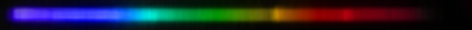

# Reference

## Atomic Spectra

### Bismuth

<https://www.atomic-spectra.net/spectrum.php?elem=Bi>

### Silicon

<https://www.atomic-spectra.net/spectrum.php?elem=Si>

### Carbon

<https://www.atomic-spectra.net/spectrum.php?elem=C>

## Media

  
Bismuth

  

  

  

  <iframe width="560" height="315" src="https://www.youtube-nocookie.com/embed/VmjrmdPNhtE?si=8RtteqVZ8DWCS2RW" title="YouTube video player" frameborder="0" allow="accelerometer; autoplay; clipboard-write; encrypted-media; gyroscope; picture-in-picture; web-share" referrerpolicy="strict-origin-when-cross-origin" allowfullscreen></iframe>

  
Moissanite (Silicon Carbide)

  
  
  

  <iframe width="560" height="315" src="https://www.youtube-nocookie.com/embed/dqPHoNUpLO8?si=aWUX9sLvNOgCyarY" title="YouTube video player" frameborder="0" allow="accelerometer; autoplay; clipboard-write; encrypted-media; gyroscope; picture-in-picture; web-share" referrerpolicy="strict-origin-when-cross-origin" allowfullscreen></iframe>

